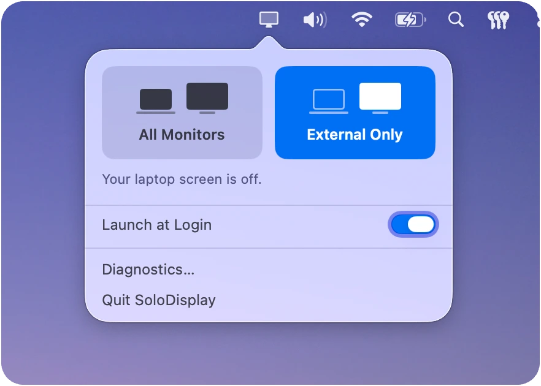

<h1 align="center">SoloDisplay</h1>

<p align="center">
  <em>Turn off the internal display without closing the lid</em>
</p>

<p align="center">
  <a href="https://github.com/fanckush/SoloDisplay/actions/workflows/ci.yml"></a>
  <a href="https://codecov.io/gh/fanckush/SoloDisplay"></a>
  <a href="https://github.com/fanckush/SoloDisplay/releases"></a>
  <a href="LICENSE"></a>
  
</p>

<p align="center">
  
</p>


Windows has External Display only mode, macOS does not have this, this little app adds that functionality.

SoloDisplay actually turns the internal panel off when an external monitor is connected. Simple as that.

## Install

<p align="center">
  <a href="https://github.com/fanckush/SoloDisplay/releases/latest/download/SoloDisplay.dmg">
    <picture>
      <source media="(prefers-color-scheme: dark)" srcset="docs/assets/download-mac-dark.svg">
      
    </picture>
  </a>
</p>


Open the DMG and drag SoloDisplay to your Applications folder.

Or install with [Homebrew](https://brew.sh), which also keeps it up to date:

```sh
brew install --cask fanckush/solodisplay/solodisplay
```

## Usage

There are two choices:

- **All Monitors** keeps your laptop screen on.
- **External Only** turns it off whenever a monitor is connected, and back on when
  you unplug.


## Build from source

Requires Xcode (Swift 6.3) and macOS 26+ on Apple Silicon. No external
dependencies.

```sh
swift build
swift test
swift run solodisplay-lab observe   # read-only; reports displays/session/lid state

open SoloDisplay.xcodeproj           # Scheme "SoloDisplay" then Run
```

Account-independent app tests (ad-hoc signed):

```sh
xcodebuild -project SoloDisplay.xcodeproj -scheme SoloDisplay -configuration Debug \
  -destination 'platform=macOS,arch=arm64' -derivedDataPath DerivedData \
  CODE_SIGN_IDENTITY=- CODE_SIGN_STYLE=Manual DEVELOPMENT_TEAM= \
  test -only-testing:SoloDisplayTests
```

## Credits

- [RonaldPark89/InternalDisplayOff](https://github.com/RonaldPark89/InternalDisplayOff),
  reference for the disable technique.
- [BetterDisplay](https://github.com/waydabber/BetterDisplay), prior art that
  proved the feature is possible.

## License

[GPL-3.0-or-later](LICENSE). SoloDisplay is free and open. If you distribute a
modified version, it has to stay free and open too.
